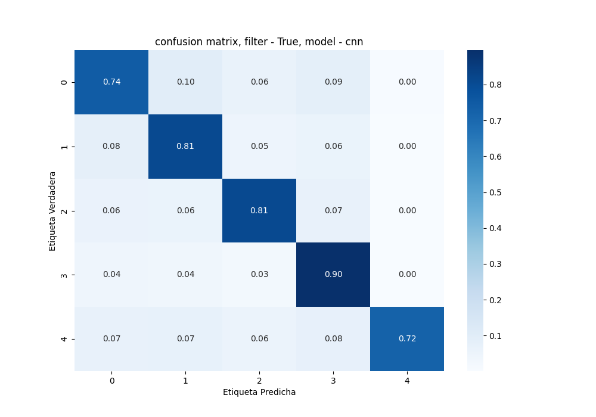

README
# Voice Identification

This is a python project for the computer vision subject of computer science career of Universitat Autonoma de Barcelona

## Introduction

The voice identification project is made for a real problem, our group has been working in a robot that need a voice identification module.
This module is not test in real conditions, is only a first model for our robot.

## Methods

The [notebook](PROYECTO/main.ipynb) is a complete description of the proyect, in the module [file](PROYECTO/voiceindent.py) we have put all the functions to preprocess and predict a audio file.

### Models

We have made some models that are explained in the [notebook](PROYECTO/main.ipynb), all of there are saved in the modelos directory, if each one of you wants to train a model, you must load some audios and follow all the instructions of [notebook](PROYECTO/main.ipynb).

### Predict and backtest

The predict functions it could be correct to make a backtest of all the models made. 
`y_pred, clase_mayoritaria = predict(
    algorithm='windowing', 
    dataType='ruido', 
    model='rf', 
    filter=True, 
    audio='tu_archivo.mp3'
)`

There is more info in the [notebook](PROYECTO/main.ipynb)
Other form to test an audio file is doing: 

`python PROYECTO/voideident.py --algorithm specsModel --dataType ruidoNorm --model cnn --filter True --audio path/to/audio.mp3
`

All the combinations possibles there are explained in the [notebook](PROYECTO/main.ipynb)

Our best model we think is: 
`python PROYECTO/voideident.py --algorithm windowing --dataType ruido --model rf --filter True --audio path/to/audio.mp3
`

And his confusion matrix is: 

## Installation

1. Clone the repository: `git clone https://github.com/albertceballos0/UAB-VC-voice-identification.git`
2. Navigate to the project directory: `cd PROYECTO`
3. Install all the python dependencies: `pip install -r requeriments.txt`

## Contributing

Contributions are welcome! If you find any issues or have suggestions for improvement, please open an issue or submit a pull request.
We are gratefull to recive new featrues. Please submit a new pull request.

## License

This project is made only for educational intention.
